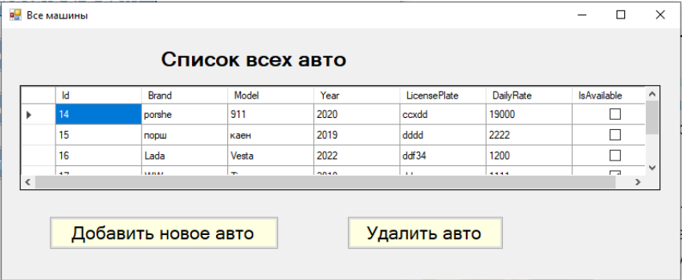

# Разработка информационной системы для аренды автомобилей

В рамках учебного проекта было разработано приложение для аренды автомобилей с применением объектно-ориентированного подхода программирования.
   **Цель проекта:** автоматизировать бизнес-процессы в области аренды автомобилей. 
 Программный продукт позволит сотруднику фирмы добавлять и удалять клиентов и автомобили в системе, заключать или расторгать аренды. Также будет разработан пользовательский интерфейс, помогающий взаимодействовать пользователю с системой. Для хранения информации будет использована база данных.

  Для создания проекта и представления данных было выбрано приложение с графическим интерфейсом пользователя Windows Forms. 
  В работе будут реализованы:
* Главная форма, с которой можно будет перейти на любую другую форму
* Формы для добавления данных (машина, клиент, аренда)
* Формы для удаления данных (машина, клиент, аренда)
* Формы просмотра данных (машины, свободные машины, клиенты и 
аренды)

Для сохранения информации о фирме используется SQL Server Express LocalDB.

## Модель предметной области

##  CRC карточки классов системы
Представлены в папке images файлы с именами crc1.png, crc2.png, crc3.png

## Диаграмма классов системы
### Основная диаграмма классов системы

### Диаграмма классов форм

##  Взаимодействие объектов
### Диаграмма последовательности добавления клиента

### Диаграмма последовательности удаления клиента

## Диаграмма деятельности
### Диаграмма деятельности добавления аренды

## Модель данных

## Разработка тестов
Для проверки правильности работы программы были разработаны модульные тесты, результат их выполнения представлен на рисунке.  

Для проверки правильности работы контроллеров с БД разработаны тест кейсы.

### Тест-кейсы добавления и изменения статуса автомобиля в БД

### Тест-кейсы получения последнего добавленного клиента и всех клиентов из БД

## Интерфейс приложения
Чтобы начать работать с приложением необходимо его запустить. После чего автоматически загрузится главная форма.   Главная форма представляет собой навигацию для пользователя, он может выбрать необходимый ему раздел. Чтобы выйти из приложения,необходимо нажать крестик.  

Для того чтобы посмотреть все автомобили, необходимо на главной форме нажать на кнопку «показать все авто».  

Чтобы добавить или удалить машины из системы, необходимо нажать на соответствующие кнопки. Формы добавление и удаления авто представлены на рисунке.  

Чтобы просмотреть все доступные автомобили (автомобили, которые не задействованы в аренде), пользователю необходимо на главной форме нажать на кнопку «показать свободные авто».  

Аналогично пользователь может нажать на главной форме на кнопку «показать всех клиентов», после чего откроется форма «Все клиенты»  

Добавление и удаление клиента происходит аналогично добавлению и удалению машины. 
  Если на главной форме нажать на кнопку «показать все аренды», то открывается форма со всеми арендами  

  Удаление аренды происходит аналогично удалению машины.  

Чтобы добавить новую аренду, пользователь нажимает на форме «Все аренды» кнопку «Добавить новую аренду». После чего появляется форма «Добавление аренды».  

Чтобы к аренде добавить клиента, пользователь должен выбрать: есть ли текущий клиент в системе. Если клиент уже занесен в систему, пользователь нажимает на кнопку «Да», вводит его id и нажимает на кнопку «Найти» (в случае если клиент не найдется, появится всплывающее окно, на котором будет написано, что такого клиента в системе нет). Если клиента нет в системе пользователь нажимает на кнопку «Нет», после чего появится форма «Добавления клиента».  

Аналогичным образом пользователь к аренде добавляет автомобиль.  

Затем пользователь может выбрать с помощью checkbox возможные дополнительные услуги (если пользователь как-то взаимодействует с checkbox, это сразу повлияет на стоимость автоматически, никаких дополнительных кнопок не надо нажимать).  

После чего пользователь выбирает сроки аренды автомобиля: дату начала и конца аренды. Чтобы подтвердить выбранные даты, пользователь нажимает на кнопку «Выбрать». Если дата конца аренды окажется более ранней, чем дата начала, то появится модальное окно, которое оповестит пользователя об этом. В случае корректного заполнения даты, выбранные даты прикрепятся к аренде.  

После того как пользователь выберет дату и машину, он может рассчитать стоимость (дополнительные услуги также будут учтены), для расчета текущей стоимости пользователю необходимо нажать на кнопку «Рассчитать стоимость». Если пользователю потребуется, он может поменять дату или машину, и снова рассчитать стоимость.  

После успешного заполнения автомобиля, клиента и даты, можно добавить аренду, для этого надо нажать на кнопку «Добавить аренду».  

### Форма "Добавления аренды"

## Результаты проекта
Разработанная система предлагает следующие функциональные 
возможности:  
- Добавление/удаление автомобилей
- Просмотр списка всех автомобилей
- Просмотр списка всех доступных автомобилей
- Добавление/удаление клиентов
- Просмотр списка всех клиентов
- Добавление/удаление аренды
- Поиск клиента и машины в системе при заключении аренды
- Возможность выбора предложенных доп. услуг при заключении аренды
- Просмотр списка всех аренд
- Хранение информации в БД о клиентах, машинах и арендах
- Расчет стоимости аренды с учетом выбранной машины, срока аренды и выбранных доп. услуг

---
Автор проекта: **Чекалин Дмитрий**
 Обратная связь:
* почта: dimacekalin2311@yandex.ru
* тг: @Dimaaeae
